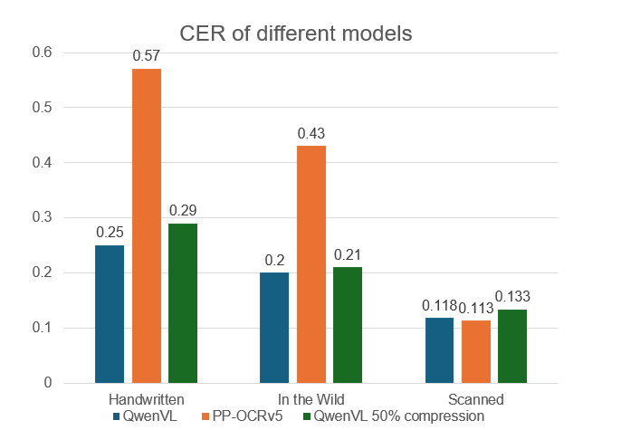

# 🚀 ROCKET: Rapid Optimization via Calibration-guided Knapsack Enhanced Truncation for Efficient Model Compression
[](https://arxiv.org/abs/2602.11008)
[](https://opensource.org/licenses/Apache-2.0)
[](https://www.python.org/downloads/)


This Repo is build upon our compression algorithm (ROCKET), which is a general LLM's compression algorithm and slightly edited to be trailored for VLM models, to make it easier to follow and understand for commitee

```
rocket/
├── setup.py
├── swiftsvd/
│   ├── __init__.py
│   ├── config/
│   │   └── default.yaml
│   ├── data/
│   │   ├── __init__.py
│   │   └── prepare_data.py          # prepare_data logic (calibration data activations)
│   ├── calib/
│   │   ├── __init__.py
│   │   └── calib.py                 # Calib class (Calib.build_calibration_dataset, Calib.get_s_inv_s, etc.) (Whitening transform)
│   ├── profiling/
│   │   ├── __init__.py
│   │   └── profiler.py              # profile_all_layers, get_k_and_sparsity, etc. (for dynamic budget allocation)
│   ├── compression/
│   │   ├── __init__.py
│   │   └── swiftsvd.py              # svd_with_magnitude_sparsity_on_v, model patching
│   ├── utils/
│   │   ├── __init__.py
│   │   ├── seed.py                  # seed_all
│   │   ├── model_utils.py           # get_weight_transposed, compute_actual_compression
│   │   └── io.py                    # JSON save/load helpers
│   ├── scripts/
│       ├── gather_activations.py
│       ├── profile_layers.py
│       ├── compress_model.py
│       ├── evaluate_model.py
│       └── run_full_pipeline.py
└── README.md
```
## Installation
We highly recommend using this docker image to ensure reproducability.
```
pytorch/pytorch:2.7.1-cuda12.6-cudnn9-devel 
```
Then run 
```bash
pip install -e .
```
## Running

to compress Qwen3-VL mode, you should first run calibration data gathering, by running this command.
```bash
python collect_calib.py --save_dir /your/path --num_samples 256 #(number of calibration data samples)
```

After that, we provide multiple console entrypoints to run the full pipeline you can easily do (Please don't forget to update the configuration file to add the path to your calib data at config["calib"]["data_path"])

you can use the sample <a href="./rocket/config/asr.yaml">config</a> fie and modify it according to your requirements 
Other entrypoint are:
```bash
swiftsvd-profile-layers --config CONFIG # To do profiling only (knapsack)
swiftsvd-compress --config CONFIG #run compression only
```


### Motivation & Approach
Traditional CNN-based ultra-lightweight OCR models often struggle in complex, real-world scenarios. They frequently fail to accurately process handwritten Russian text or in-the-wild documents, where varying backgrounds, rotations, and text alignments pose significant challenges.

While Vision-Language Models (VLMs) offer superior robustness in these conditions, they typically demand high VRAM and computational resources, limiting their accessibility for resource-constrained deployments. To bridge this gap, we compressed the `Qwen/Qwen3-VL-2B-Instruct` model by 50% down to a ~1B parameter variant, followed by a lightweight recovery fine-tuning phase (1,000 steps) to preserve critical OCR capabilities.

### Evaluation & Results
We evaluated the compressed model across three key benchmarks: **Handwritten Text**, **In-the-Wild Scenes**, and **Simple Scanned Text**.



As illustrated above, the compressed model maintains performance highly competitive with the original 2B base model. Notably, it significantly outperforms `PPOCR-v5`—the leading open-source ultra-lightweight OCR model—on complex tasks (handwritten and in-the-wild). Meanwhile, `PPOCR-v5` remains highly effective on straightforward scanned text, as expected..

